Strona która jako pierwsza wyświetla się po kliknięciu wpisaniu adresu
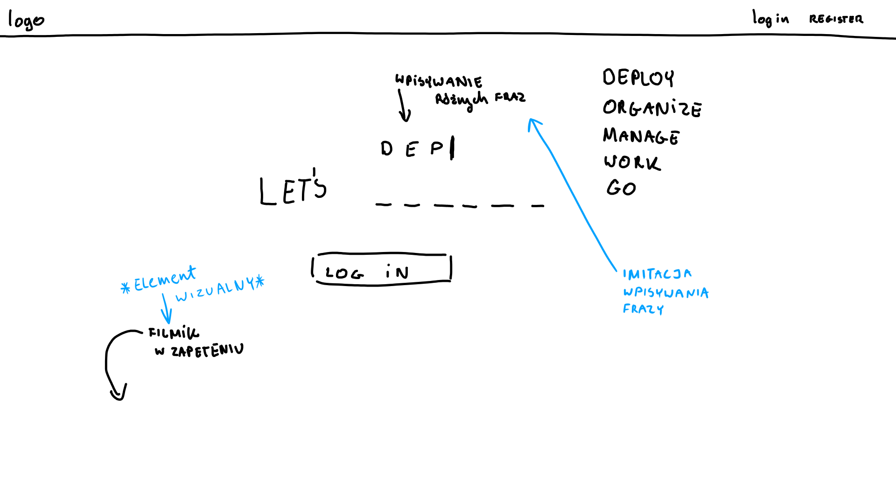

Logowanie się na stronę
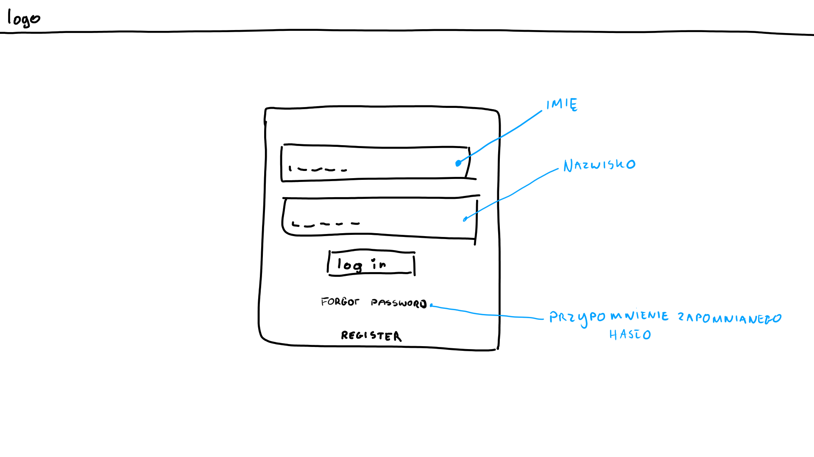

Rejestracja użytkownika
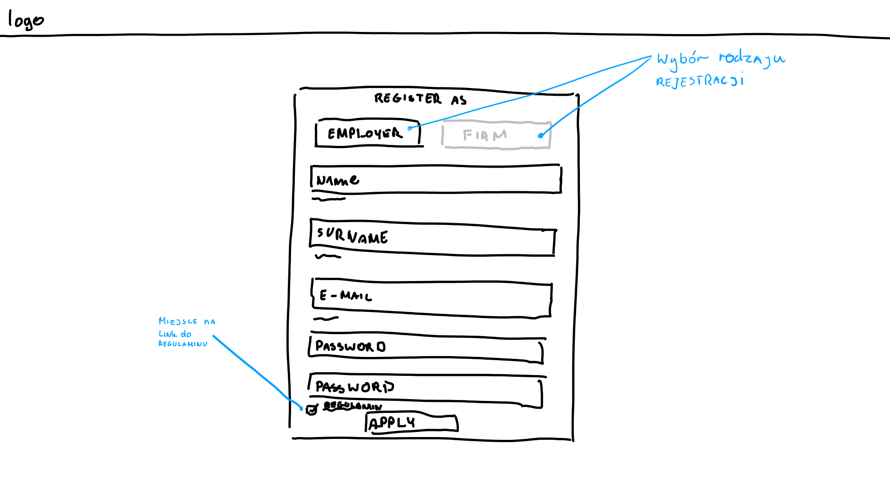

Rejestracja firmy
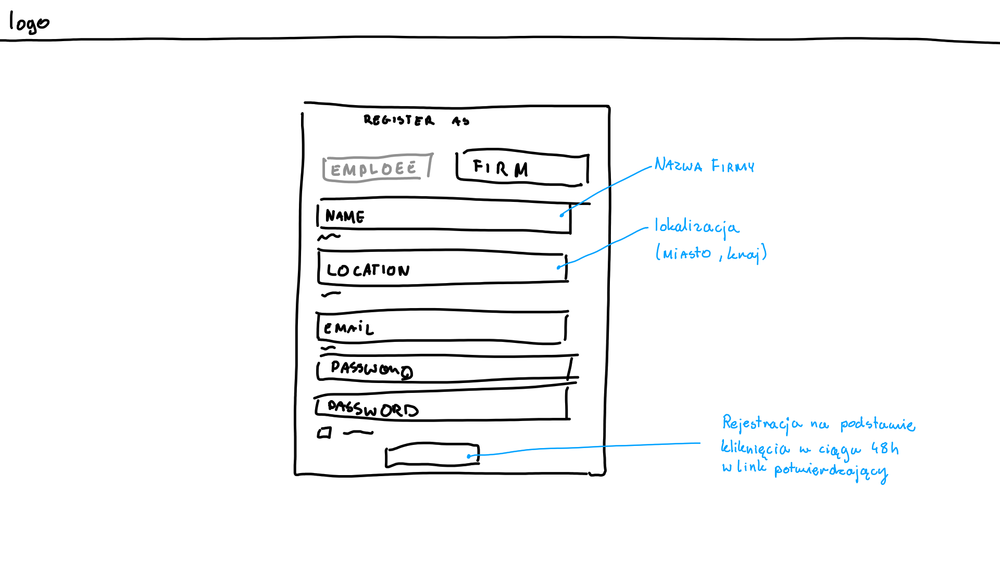

Po zalogowaniu wyświetlona strona dla użytkownika
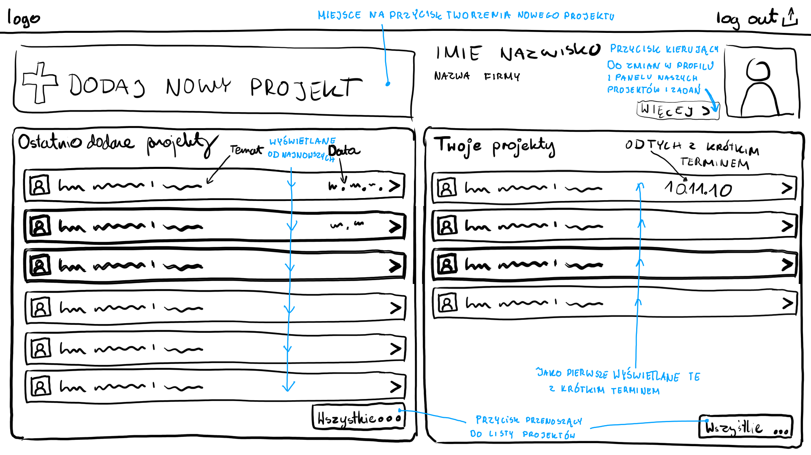

Wyświetlanie listy projektów
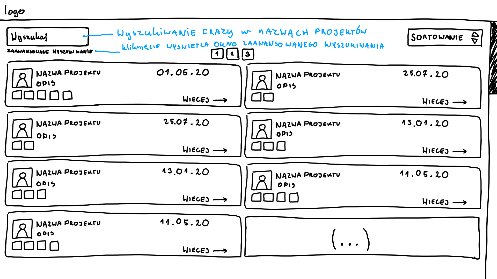

Wyszukiwanie zaawansowane w widoku projektów
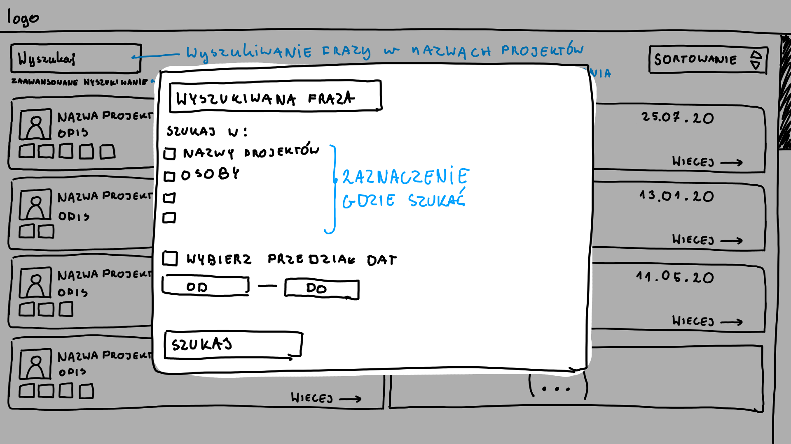

Boczny panel po wejściu w projekt
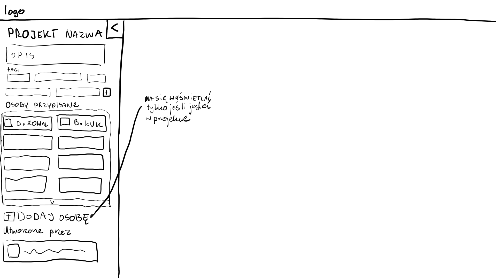

Po schowaniu panelu wyświetlanie projektu
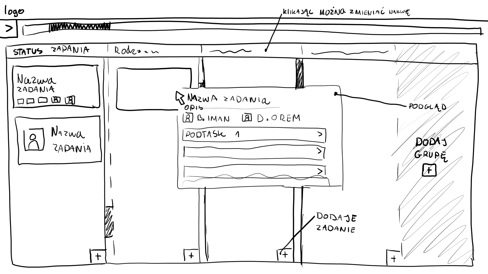

Wyświetlanie zadania po kliknięciu w nie
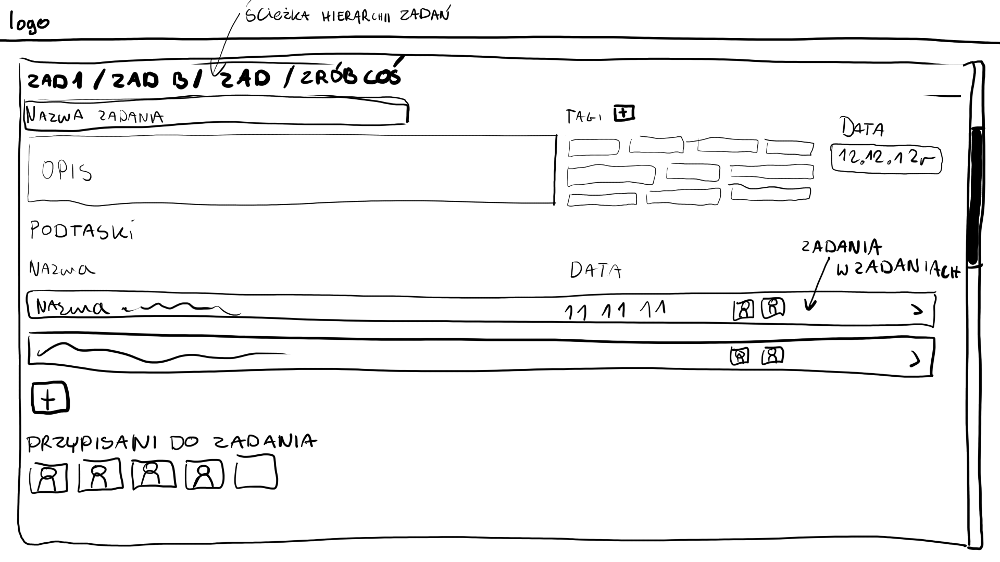

Widok wejścia w konto usera
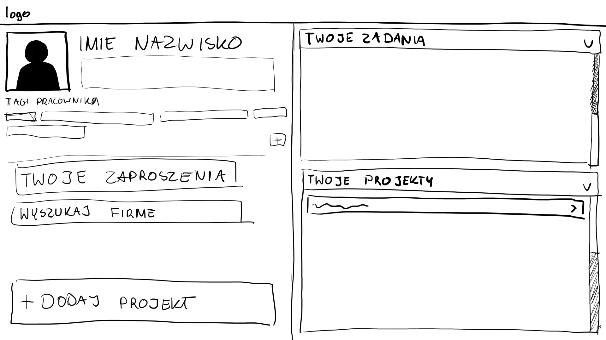